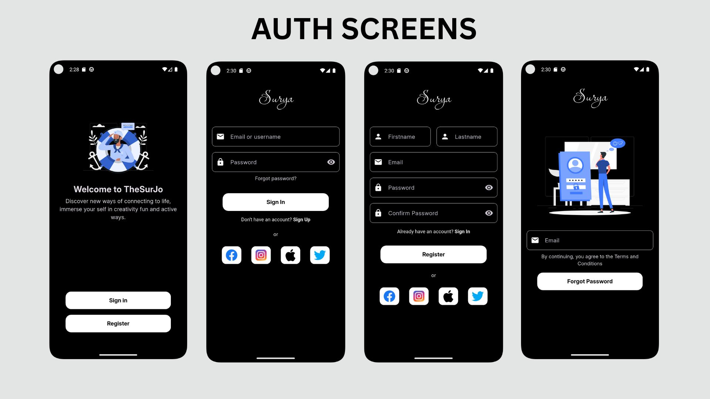

# Flutter Auth UIKit

FlutterAuthUI is a clean and modern Flutter app showcasing beautifully designed authentication screens inspired by Dribbble’s top UI/UX trends. It features sleek login, registration, and password recovery screens and intuitive user flow.

---

## Features

* **Dribbble-Inspired Design:** Minimalist and elegant UI with balanced spacing, vibrant accent colors, and smooth transitions.
* **Login Screen:** Simple form with email/password fields,and social login buttons.
* **Registration Screen:** Clean signup form with validation-ready fields and clear call-to-action buttons.
* **Password Recovery:** Easy-to-use "Forgot Password" screen with email input.
* **Responsive Layout:** Works well on different screen sizes and device orientations.
* **Consistent Typography & Colors:** Modern fonts and harmonious color palettes for great readability.

---

## Screenshots



---

## Getting Started

### Run Locally

```bash
git clone https://github.com/NabunyaLilian/auth-ui-kit.git
flutter pub get
flutter run
```

---

## Inspiration

The UI designs for these auth screens are inspired by this dribble design [Login-Sign-Up-Design](https://dribbble.com/shots/18891378-Login-Signup-Design-Flutter-App).

---

## License

MIT License © 2025 Lilian Nabunya

---

